
# Final Project - House Of Kicks

House Of Kicks is website for sneakerheads to buy the most hyped sneakers that are out there. The website isn't just a shopping destination, it also educates user about the sneaker culture. Users can browse a catalog of bestselling and in demand sneakers. They can check the rating, available prices, historical prices and description of each shoe. Users can add the sneakers they like into the cart, enter their address and complete their order through the payment gateway. They also have the ability to see how if the sneakers they own have turned out to be good investments.   The website is an end to end solution that enables sneaker head to get their hands on the most hot pair of sneakers in the market.

Following are all the pages that are part of the webiste:

1. Login / Sign Up - The user will have to Log In to enter the website. If the user hasn't signed up then they will have sign up by providing email and other essential details. If the user is already registered then after successfully logging into the website with correct credentials user will be redirected to the Landing page. 

2. Landing Page - The Landing page has a carousel with banners of brands that have their products on the website like Nike, New Balance and Adidas. Followed by the carousel there is an array of bestselling shoes. User can click on any of them to be redirected to the page of that particular shoe. 

3. Product Catalog - The product catalog has displays all the sneakers that are available for sale on the website. There is a thumbnail, name and price. On clicking on the sneaker the user is redirected to productDetails page. 

4. Product Details - The product details page has a gallery of images showing the sneaker from different angles. Then on the right side user can see the category, name, rating and price of the shoe. A set boxes is used to show which sizes are available for purchase. Then there is a buy now button that adds the shoe to the cart. After the button there is a description about the shoe. In the end there is graph depicting historical prices of the shoe.

5. Cart - Everytime user hits the buy now button for the shoe it is added to the cart. In the cart user can see the name of the shoe and the price next to it. The total amount is also displayed. User will have to enter the address by entering their Street Address, City, State and pincode to complete the order.

6. Portfolio - Portfolio is a page that helps user reflect upon their purchases as investments. Total profit/loss made for each shoe by amount and percentage is shown in the table. Below the table there are statistics showing total profiy/loss amount, total profit/loss percentage and total money spent.

7. Profile - In the profile page user can view and update their own details. Only the email id field cannot be updated.

8. Admin - Admin panel is only accessible to admin and not to other users. Admin can view different statistics related to the sales of sneakers. They can see all the users that are on the platform and also delete them.

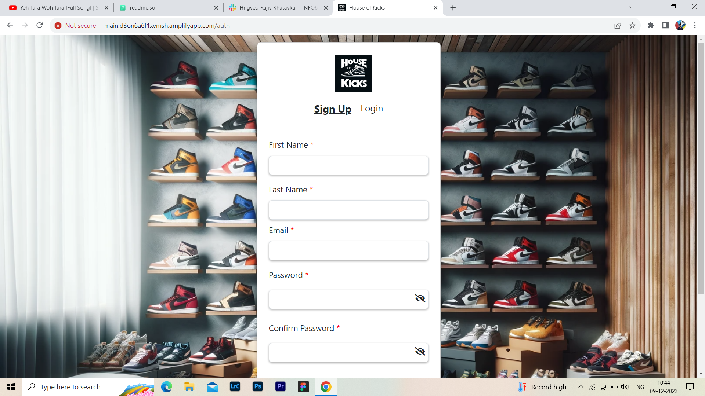
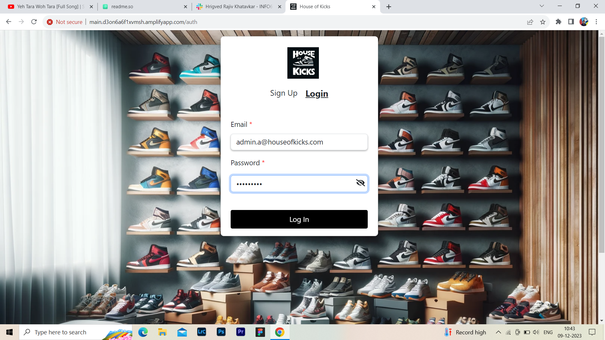
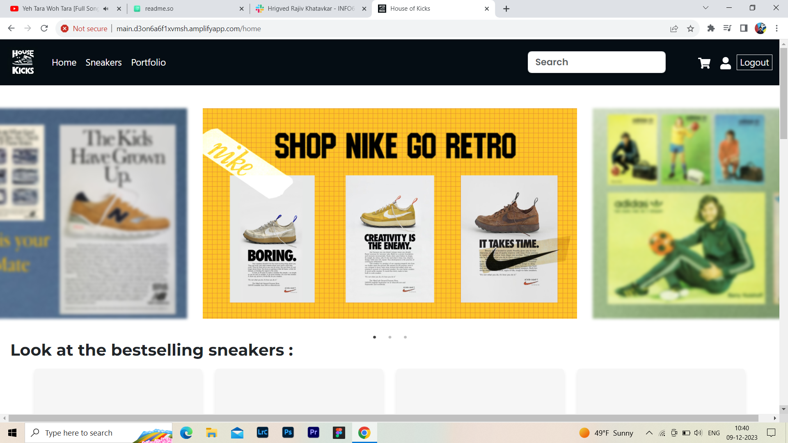
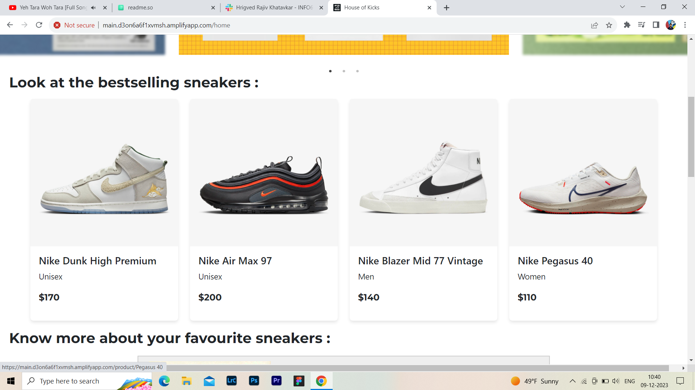
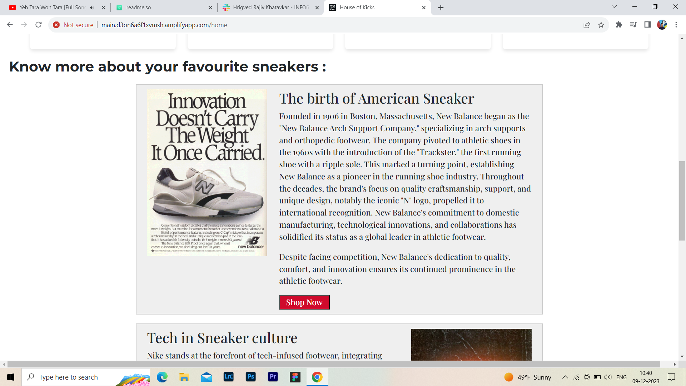

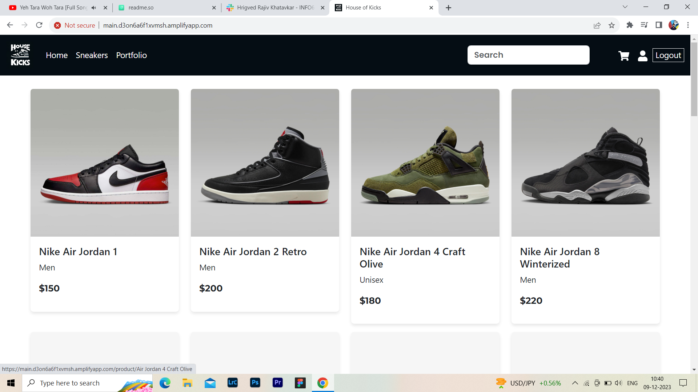
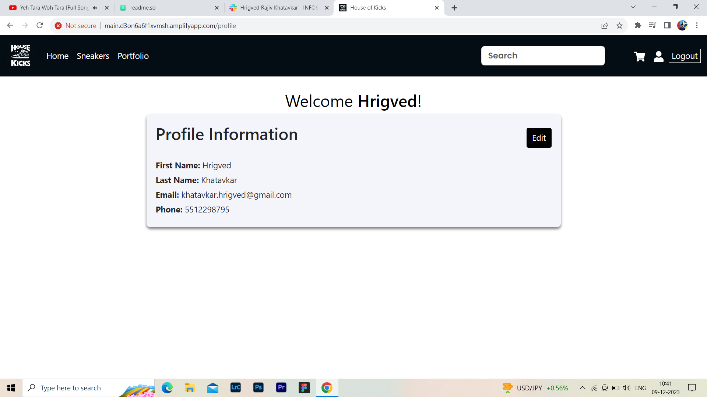
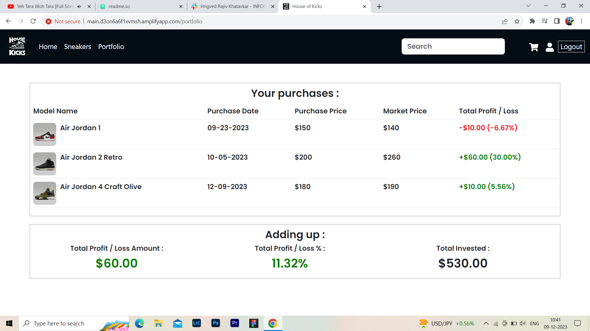
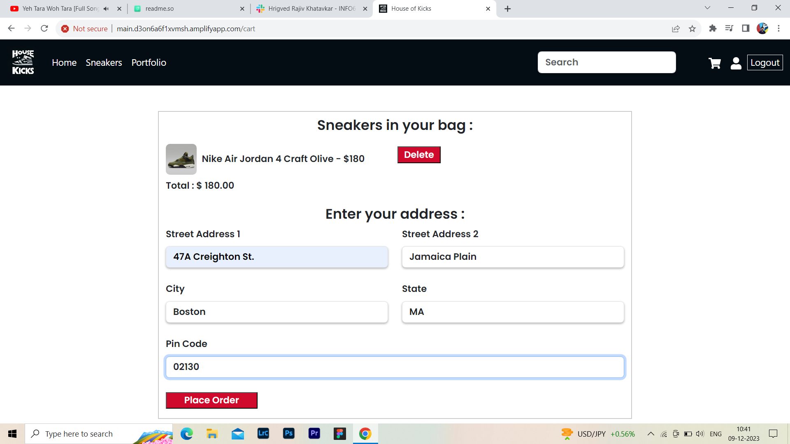

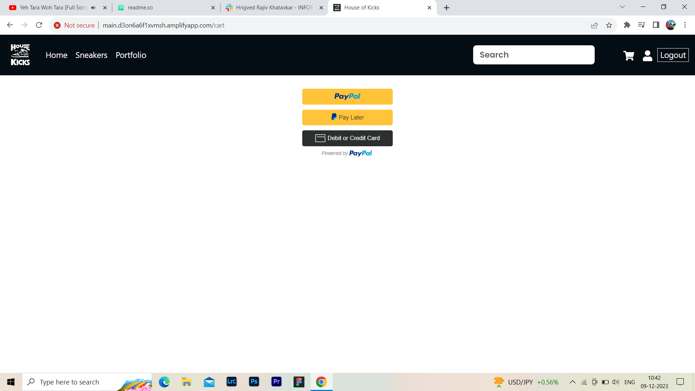
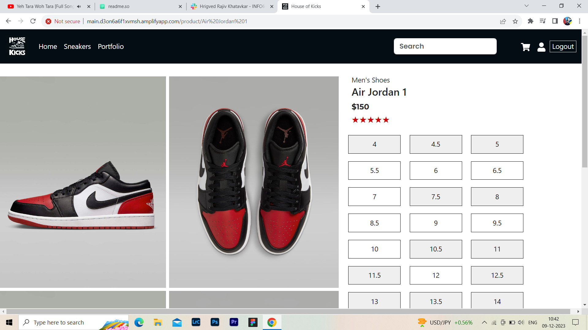
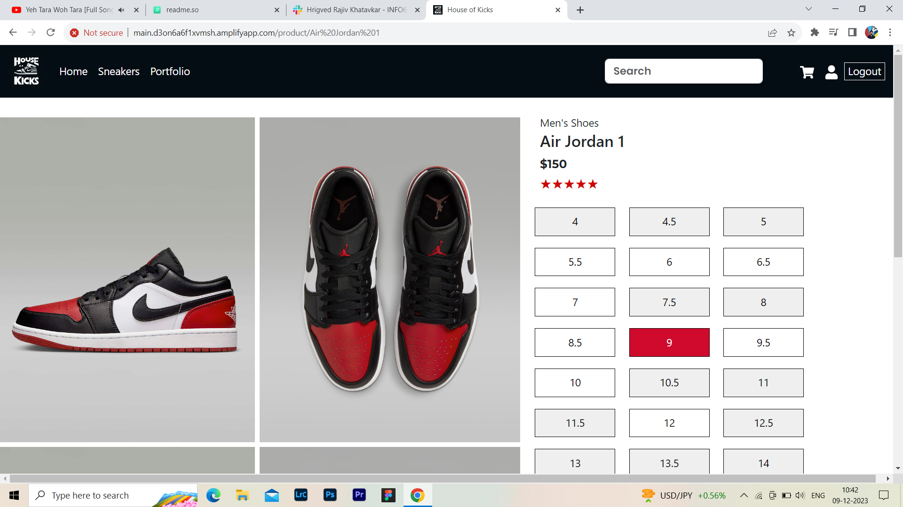
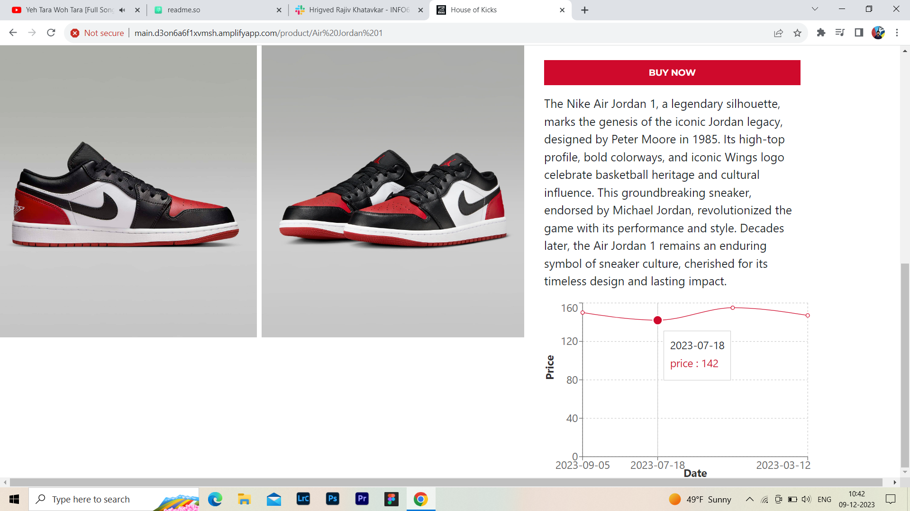
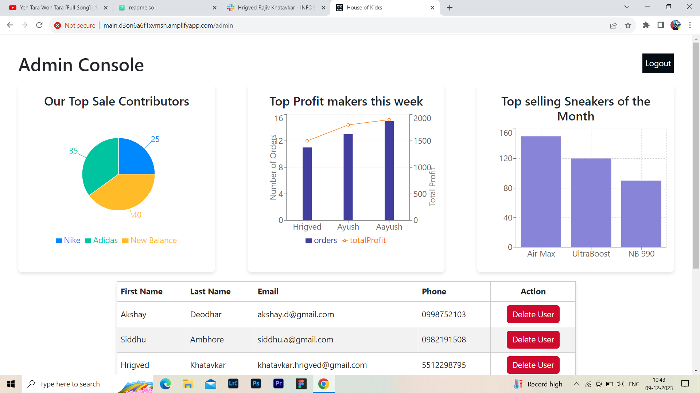
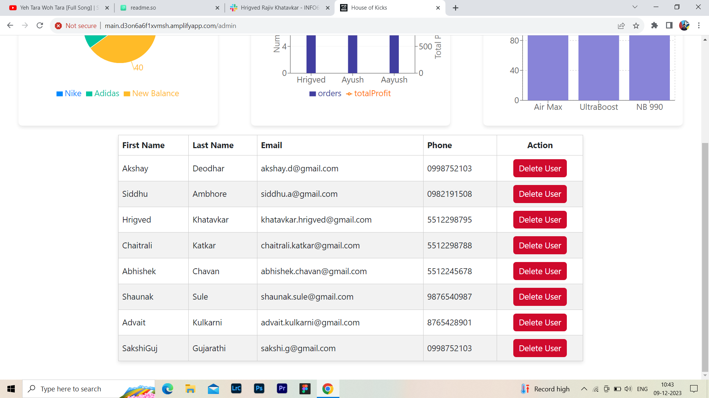

